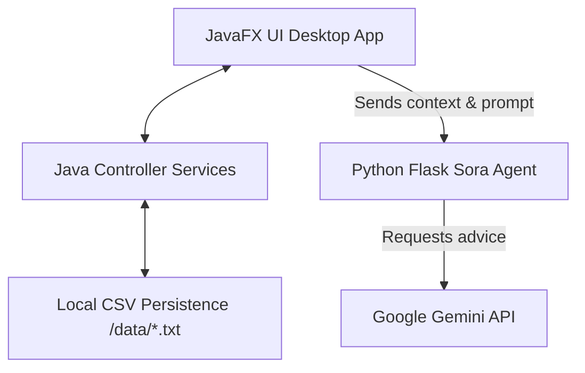

# 🌌 Sora: Personal Finance Dashboard & AI Financial Advisor

Sora is a premium, privacy-first personal finance tracking application. It combines a high-performance **JavaFX** dashboard UI with a local, serverless database persistence model and integrates a **Gemini AI Financial Advisor** (Sora Agent) to offer automated budget safety advice.

---

## 🚀 Key Features

*   **📊 Dynamic Summary Metrics**: Track total balances, dynamic income/expense aggregates, and current net balances.
*   **💳 Multi-Account Wallets**: Seamlessly track balances across various financial platforms (e.g. GCash, bank accounts, personal wallets).
*   **🎯 Interactive Savings Goals**: Configure targets with custom milestone icons, live progress indicators, and incremental savings allocation.
*   **💸 Budget Tracking & Quick-Log**: Establish category-specific budget limits. Log direct expenses against a budget using a quick `+` button shortcut, or remove active budgets instantly.
*   **🔄 Subscriptions & Recurring Bills**: Track monthly subscription costs, billing cycle intervals, and active plans.
*   **🤖 Sora AI Agent**: An integrated artificial intelligence advisor running Google's **Gemini-Flash API**. Sora securely analyzes your income, spending, and accounts to provide personalized financial guidance.
*   **🔑 Remember Me & Auto-Login**: Support session persistence so returning users can log straight into the dashboard without entering passwords every time.

---

## 🛠️ System Architecture



---

## 📋 System Requirements

*   **Java SE Development Kit (JDK) 25.0.2**
*   **OpenJFX (JavaFX) SDK 25.0.2**
*   **Python 3.10+** (with virtualenv/pip)
*   **Google Gemini API Key**

---

## ⚙️ Setting Up & Running the Project

### 1. Configure the AI Agent (Python Backend)

Navigate to the `sora_agent` folder and install dependencies:

```bash
cd sora_agent
pip install -r requirements.txt
```

Create a file named `.env` in the `sora_agent/` directory:

```env
GEMINI_API_KEY=your_actual_gemini_api_key_here
```

Run the Sora Agent background API:

```bash
python agent.py
```

*The Sora Agent will run locally at `http://127.0.0.1:5000/advise`.*

---

### 2. Compile & Run the Desktop Application (JavaFX)

Ensure your environment variables are configured, or use absolute paths for the compiler and JavaFX modules.

#### 🔨 Compilation Command (Windows PowerShell)

```powershell
& 'C:\Program Files\Java\jdk-25.0.2\bin\javac.exe' --module-path 'D:\CODES\openjfx-25.0.2_windows-x64_bin-sdk\javafx-sdk-25.0.2\lib' --add-modules javafx.controls,javafx.fxml -d bin (Get-ChildItem -Recurse -Filter *.java src\main\java).FullName
```

#### 🚀 Execution Command (Windows PowerShell)

```powershell
& 'C:\Program Files\Java\jdk-25.0.2\bin\java.exe' --module-path 'D:\CODES\openjfx-25.0.2_windows-x64_bin-sdk\javafx-sdk-25.0.2\lib' --add-modules javafx.controls,javafx.fxml -cp bin com.sora.ui.Launch
```

---

## 📂 Project Structure

```
Sora/
├── data/                      # Local CSV database flat files
│   ├── users.txt
│   └── budgets_[id].txt
├── Resources/                 # Assets & layouts styling
│   ├── icons/                 # Visual icon graphics
│   ├── fonts/                 # Custom typefaces (Public Sans)
│   ├── loginStyle.css         # Styling for landing & onboarding forms
│   └── DashboardStyle.css     # Styling for core dashboard views
├── sora_agent/                # AI Agent service (Flask & Gemini SDK)
│   ├── agent.py
│   └── requirements.txt
└── src/main/java/com/sora/    # Application source code
    ├── model/                 # Data model classes
    ├── service/               # Operations & file integrations service
    ├── ui/                    # JavaFX views & layout engines
    └── util/                  # File read & write utilities (FileHandler)
```

---

## 🔒 Security & Data Isolation
*   **Unique Accounts Isolation**: Every registered user is assigned a distinct user identification sequence (`SRA-xxxx`). Data files containing transaction details, goals, and budgets are saved separately per user ID, ensuring complete isolation in multi-user environments.
*   **Validation Constraints**: Form controls reject duplicate email registrations, password disparities, and formatting inconsistencies at submission.
